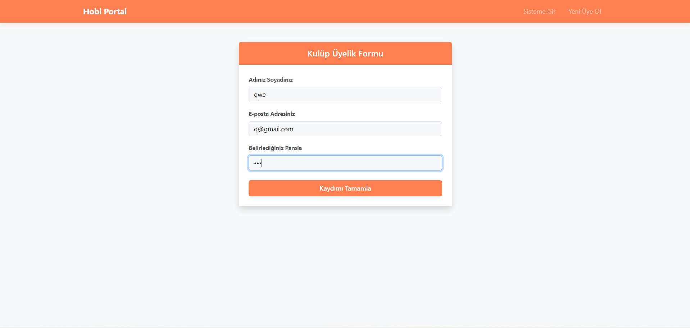
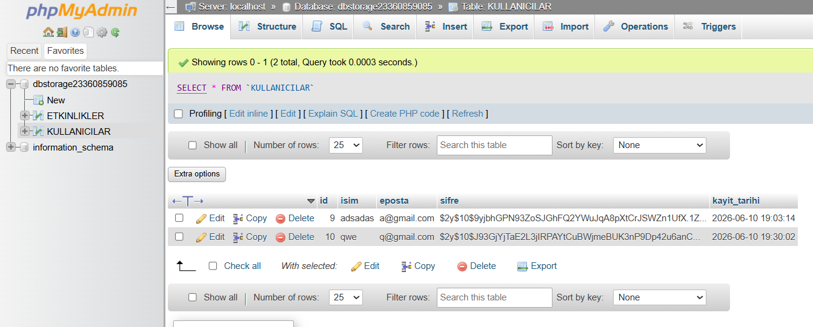
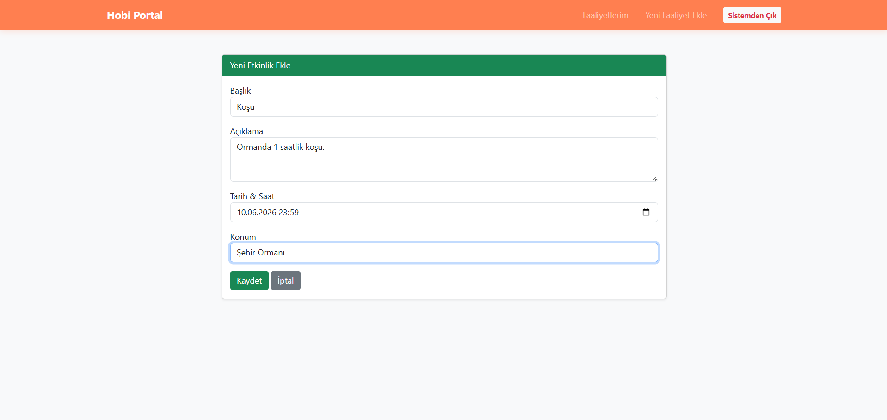
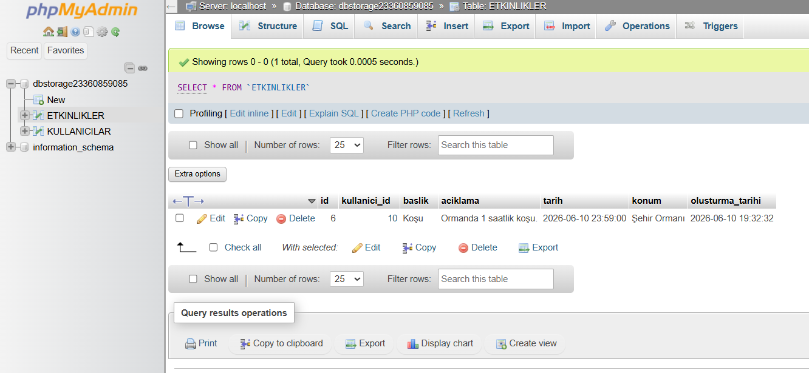
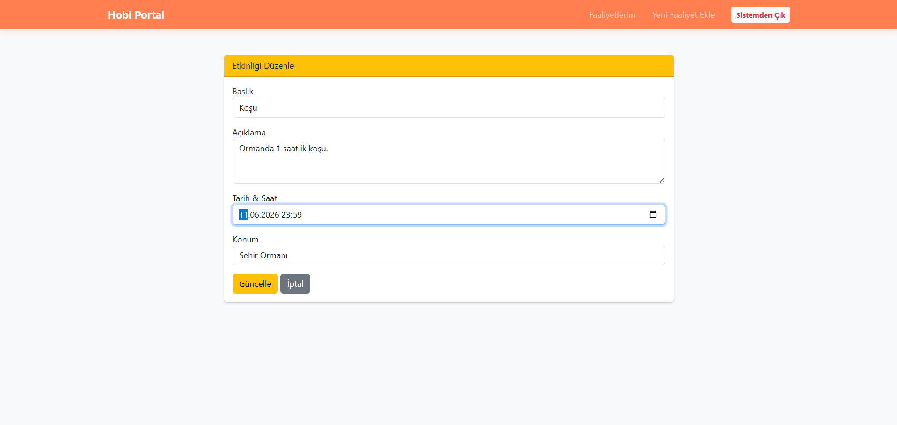
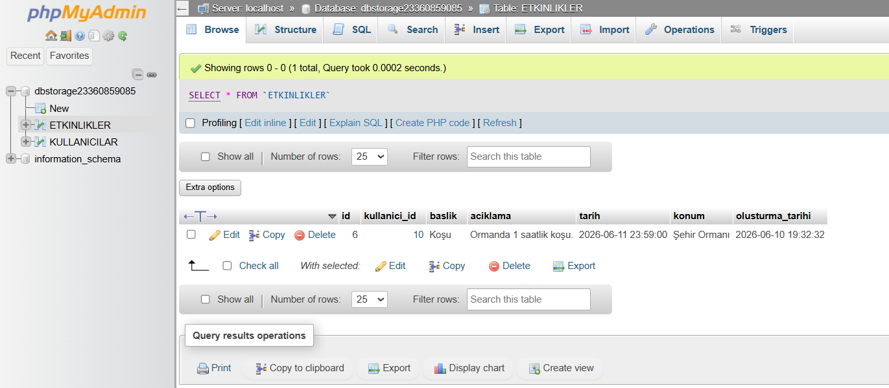
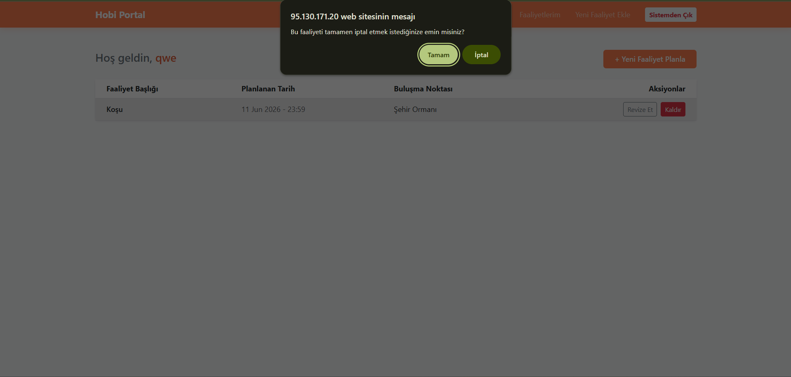
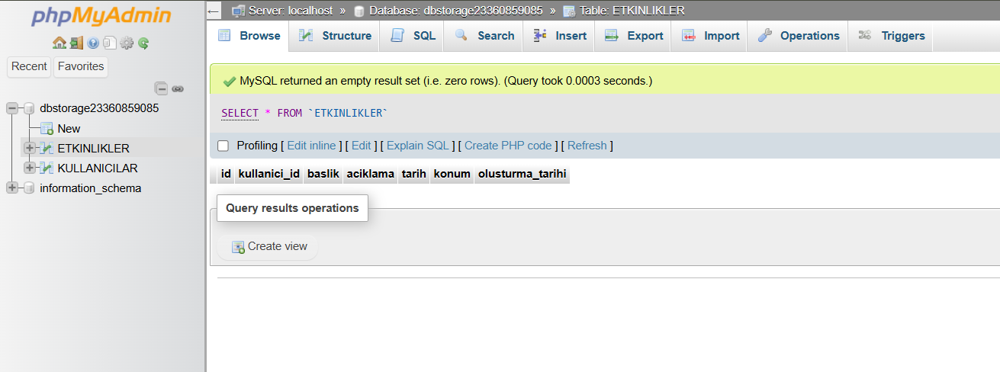

# Doğa & Hobi Kulübü Yönetim Portalı

Açık havada ve hobi alanlarında faaliyet gösteren topluluklar için geliştirilmiş, etkinlik planlama ve üye yönetimini tek bir noktadan sağlayan dijital bir portaldır. Bu proje, ham PHP ve MySQL/MariaDB kullanılarak, modern yazılım geliştirme ve veri yönetimi prensiplerine uygun olarak inşa edilmiştir.

## 🔗 Canlı Demo & Video Sunumu

* [**Canlı Uygulama Linki**](http://95.130.171.20/~st23360859085/) (Hosting üzerinde sorunsuz çalışmaktadır)
* [**Video Sunumu (YouTube)**](https://www.youtube.com/watch?v=YOUR_VIDEO_ID) (Uygulamanın çalışır halini ve teknik detaylarını anlattığım video)

## 🚀 Temel Özellikler (CRUD)

Uygulama, temel veri yönetimi (CRUD) işlemlerini ve güvenli üye oturumlarını tam olarak destekler:

1. **Kullanıcı Kaydı:** Yeni üyeler sisteme güvenli bir şekilde kaydolabilir (`kayit.php`).
2. **Güvenli Oturum (Session):** Kayıtlı kullanıcılar `$_SESSION` ile kontrol edilen güvenli bir oturum açıp kapatabilir (`giris.php`, `cikis.php`).
3. **Faaliyet Oluşturma (Create):** Kullanıcılar yeni kulüp etkinlikleri planlayıp sisteme işleyebilir (`etkinlik-ekle.php`).
4. **Faaliyet Listeleme (Read):** Eklenen tüm etkinlikler ana sayfada dinamik bir tabloda görüntülenir (`index.php`).
5. **Faaliyet Düzenle (Update):** Etkinlik bilgileri (tarih, konum, içerik) güncellenebilir (`etkinlik-duzenle.php`).
6. **Faaliyet Sil (Delete):** İptal olan etkinlikler onay adımından geçtikten sonra sistemden kaldırılabilir (`index.php`).

## 💻 Teknik Özellikler & Güvenlik

* **Arka Uç:** Tamamen yalın (pure) **PHP 8+** kullanıldı; harici bir framework kullanılmadı.
* **Veritabanı:** **MySQL/MariaDB** ile ilişkisel bir yapı kuruldu.
* **Ön Uç:** **Bootstrap 5** kütüphanesi üzerine özelleştirilmiş 'Coral' (Mercan) renk teması ve Flexbox (esnek kutu) mimarisi uygulandı.
* **PDO Mimarisi:** Tüm veritabanı bağlantıları **PDO (PHP Data Objects)** üzerinden sağlandı.
* **Güvenlik:** SQL Injection saldırılarını önlemek amacıyla tüm sorgularda **'Prepared Statements' (Hazırlanmış İfadeler)** yapısı kullanıldı. Şifreler veritabanına `password_hash()` ile kriptolanarak kaydedildi.

## 📊 Veritabanı Şeması

Veritabanımızda iki ilişkisel tablo bulunmaktadır:

1. **`KULLANICILAR`:** Üye bilgileri ve şifrelenmiş kimlik doğrulama verileri.
2. **`ETKINLIKLER`:** Üyelere ait faaliyetlerin detayları (`kullanici_id` ile `KULLANICILAR` tablosuna bağlıdır).

## 🖼 Arayüz Görselleri (Galeri)

### 1. Sisteme Giriş
 

### 2. Veri Girişi
 

### 3. Veri Güncelleme
 

### 4. Veri Silme
 

## 🛠 Kurulum (Localhost)

Projeyi kendi bilgisayarınızda test etmek için:

1. Bu depoyu (repository) indirin veya klonlayın.
2. Dosyaları XAMPP/WAMP dizinindeki `htdocs` klasörünün içine aktarın.
3. phpMyAdmin üzerinden yeni bir veritabanı oluşturun ve tabloları (`KULLANICILAR` ve `ETKINLIKLER`) oluşturun.
4. **Kritik Adım:** Projeyi kendi yerel ortamınızda çalıştırırken, canlı sunucu veritabanı ayarlarının olduğu `config.php` dosyasını kendi localhost ayarlarınıza göre (örn: root, şifresiz) düzenleyin. `.gitignore` kullanıldığı için bu değişiklikler sunucudaki hassas bilgilerinizi etkilemeyecektir.

## 👨‍💻 Geliştirici

* **[Adınız Soyadınız]** - [GitHub Profil Linkiniz]
